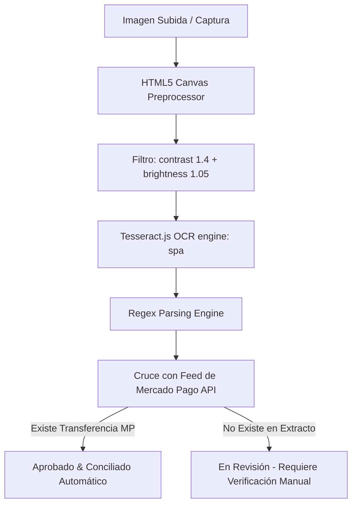

# 🧠 MEMORIA TÉCNICA Y LÓGICA DEL PROCESO DE OCR - HAEDO FUTSAL APP

Documento de preservación permanente para la arquitectura de lectura de comprobantes de pago (OCR), extracción estructurada de datos y cruce con billeteras virtuales.

---

## 1. Flujo de Procesamiento de Imagen



---

## 2. Preprocesamiento HTML5 Canvas (`ocrService.js`)
Para neutralizar líneas de escaneo (**patrón de muaré / moiré**) y reflejos al fotografiar pantallas de celular o computadoras:
```javascript
ctx.filter = 'contrast(1.4) brightness(1.05)';
ctx.drawImage(img, 0, 0, w, h);
```

---

## 3. Motor de Expresiones Regulares (Parsers Estructurados)

### A. Parser de Fechas Españolas (`parseDate`)
Soporta formatos numéricos (`25/07/2026`, `25-07-26`) y fechas en texto completo (`Miércoles, 29 de julio de 2026`):
```javascript
const monthMap = { 
  ene: '01', enero: '01', feb: '02', febrero: '02', mar: '03', marzo: '03', 
  abr: '04', abril: '04', may: '05', mayo: '05', jun: '06', junio: '06', 
  jul: '07', julio: '07', ago: '08', agosto: '08', sep: '09', septiembre: '09', 
  oct: '10', octubre: '10', nov: '11', noviembre: '11', dic: '12', diciembre: '12' 
};

const monthRegex = /\b(\d{1,2})\s*(?:de)?\s*([a-z]{3,10})\s*(?:de)?\s*(\d{2,4})?\b/i;
```

### B. Parser de Número de Operación (`parseOperationId`)
Captura IDs numéricos (8 a 14 dígitos) incluso si la frase "Número de operación de Mercado Pago" está dividida en múltiples líneas:
```javascript
const opRegex = /(?:N[°º\.]*|Número|Num|ID)?\s*(?:de|da)?\s*(?:la)?\s*(?:operación|operacion|comprobante|transaccion)[\s\w\n\r]*?[:\s\n\r]+(\d{8,14})/i;
```

### C. Parser de COELSA ID (`parseCoelsaId`)
El COELSA ID en Argentina es strictly **ALFANUMÉRICO** (letras + números, entre 14 y 35 caracteres). Se descartan CBUs/CVUs (que son puramente numéricos de 22 dígitos):
```javascript
const coelsaRegex = /(?:COELSA|CoelsaID|Referencia|Id Bancario)[:\s]+([A-Z0-9]{14,35})/i;
// Filtro obligatorio: Must contain both letters AND numbers
```

### D. Parser de Emisor (`parseEmisor`)
Captura el nombre de quien envía la transferencia o la línea inmediatamente superior a "Transferencia recibida".

---

## 4. Detección de Billetera de Origen (`detectWalletFromText`)
Detecta automáticamente las siguientes plataformas:
- `Personal Pay`
- `Mercado Pago`
- `Cuenta DNI`
- `Banco Galicia`
- `BBVA` / `Santander` / `Brubank` / `Ualá` / `Naranja X` / `Lemon Cash` / `MODO`

---

## 5. Regla de Oro Financiera: Aprobación y Conciliación
1. **Un comprobante SOLO se aprueba automáticamente si se encuentra la transferencia correspondiente en la cuenta del club (Mercado Pago)**.
2. Si el OCR lee todos los datos de forma perfecta pero la transferencia **no figura en el extracto**, el comprobante pasa a **`en_revision`** con aviso: *"No encontrada en la cuenta del club"*.
3. Al aprobar manualmente en el panel de auditoría o de forma automática, el sistema ejecuta la conciliación vincular inmediatamente.
